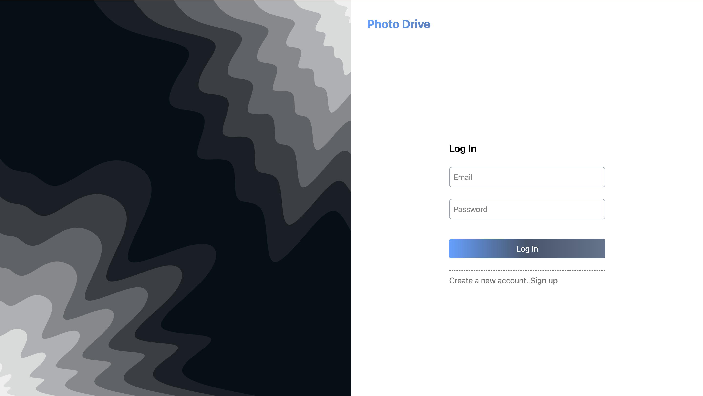
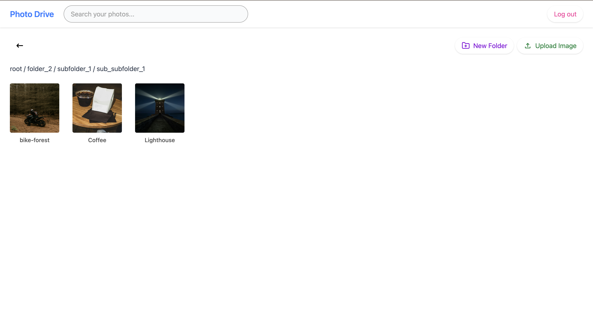
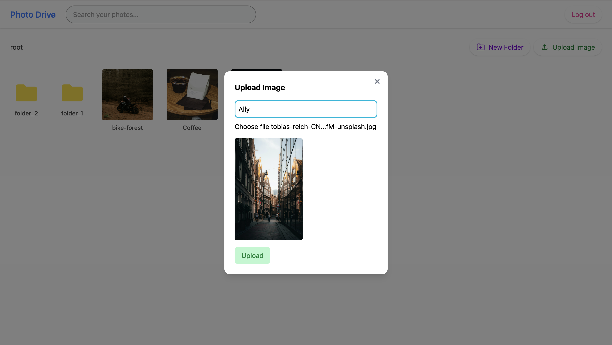

```markdown
# 📸 Photo Drive – Frontend

A modern **React + Vite + TypeScript** frontend for the Photo Drive app. Users can **sign up, log in, create nested folders, upload images to Cloudinary, and browse/search their own files**.

**Live:** https://photo-drive-frontend.vercel.app

---

## 🛠️ Tech Stack

<p>
  
  
  
  
  
  
  
  
</p>

---

## ✨ Features

- 🔐 **Auth (Signup → Login → Logout)** using JWT in **HttpOnly cookies**
- 🗂️ **Nested folders** with breadcrumb navigation
- 🖼️ **Image upload**: client → **Cloudinary** → backend metadata save
- 🔎 **Search** (client-side filter; server-side supported via `q` param)
- 👤 **User-scoped data**: users only see their own folders/images
- ⚡ **React Query** for caching, re-fetching, and optimistic UX
- 📱 **Responsive UI** with Tailwind + lightweight shadows

---

## 📁 Project Structure

```

src/
├── App.tsx
├── assets/
├── auth/
│   ├── AuthForm.tsx
│   └── useAuth.ts
├── components/
│   └── Navbar.tsx
├── Hooks/
│   └── userContext.ts
├── lib/
│   ├── api.ts            # Axios instance (baseURL + credentials + interceptors)
│   └── queryClient.ts    # React Query client
├── pages/
│   ├── AuthPage.tsx
│   └── FileExplorer.tsx
├── index.css
├── main.tsx
└── vite-env.d.ts

````

---

## 🔗 API Endpoints Used (from backend)

> You don’t need to change these here; the backend README covers full details.  
> The frontend calls:

- `POST /api/auth/signup`
- `POST /api/auth/login`
- `POST /api/auth/logout`
- `POST /api/auth/refresh`
- `GET  /api/folders?parent=<folderId|null>`
- `POST /api/folders`
- `GET  /api/images?folder=<folderId|null>&q=<string?>`
- `POST /api/images/upload` (metadata save after Cloudinary upload)

---

## ⚙️ Environment Variables

Create **`.env`** in the frontend root:

```env
VITE_API_URL=https://photo-drive-backend.onrender.com
VITE_CLOUDINARY_CLOUD_NAME=your_cloud_name
VITE_CLOUDINARY_PRESET=your_unsigned_upload_preset
````

> 🔒 **Security note:** This setup uses **unsigned** Cloudinary uploads for simplicity. For production, prefer **signed uploads** (server-generated signature).

---

## 🧪 Local Development

```bash
# 1) Install deps
npm install

# 2) Run dev server
npm run dev  # http://localhost:5173

# 3) Build
npm run build


---

## 🔌 Axios Client (cookies + refresh)

`src/lib/api.ts` (reference implementation):

```ts
import axios from "axios";

const api = axios.create({
  baseURL: import.meta.env.VITE_API_URL,
  withCredentials: true, // ⬅️ send/receive HttpOnly cookies
});

export default api;
```

---

## 🔐 Auth Flow (Important)

* **Signup**: creates the user. Does **not** auto-login.
* **Login**: sets `access_token` & `refresh_token` **HttpOnly** cookies.
* **Frontend**:

  * After successful **signup**, switch UI to **Login** mode.
  * After **login**, proceed to the app (state stored via context).
* **Logout**: clears cookies on the server and resets UI.

---

## ☁️ Cloudinary Setup

1. Create a **Cloudinary** account.
2. Create an **unsigned upload preset** (for this demo):

   * Settings → Upload → Upload presets → **Add upload preset**
   * Unsigned: **Enabled**
   * Folder (optional)
3. Put the cloud name & preset in `.env`:

   * `VITE_CLOUDINARY_CLOUD_NAME`
   * `VITE_CLOUDINARY_PRESET`

Upload flow in the UI:

* Choose a file → upload to Cloudinary → get `secure_url` + `public_id` → save metadata to backend (`/api/images/upload`).

---

## 🔎 Search

* **Client-side**: current UI filters images by name in the current folder.
* **Server-side** (supported): pass `q` query param to `/api/images` to search on the server across **your** images only.

---

## 🌐 Deployment (Vercel + Render) — CORS & Cookies

To avoid **401 Unauthorized** due to cookies not being sent:

**Frontend (Vercel):**

* Uses `VITE_API_URL=https://<your-backend>.onrender.com`
* Axios `withCredentials: true`

**Backend (Render):**

* CORS:

  * `origin: "https://photo-drive-frontend.vercel.app"` (no `*`)
  * `credentials: true`
* Cookies:

  * Set `SameSite: 'none'`, `secure: true` for both `access_token` and `refresh_token`
  * Use **HTTPS** (Render + Vercel are HTTPS in production)

**Example (Express):**

```ts
app.use(cors({
  origin: "https://photo-drive-frontend.vercel.app",
  credentials: true,
}));
app.use(cookieParser());
```

**Set cookies (server):**

```ts
res.cookie('access_token', token, {
  httpOnly: true,
  sameSite: 'none',
  secure: true,
  maxAge: 10 * 60 * 1000,
});
```

> If you still see 401s: confirm the **response actually sets cookies** (DevTools → Network → Response Headers → `set-cookie`), and that the **request** includes cookies (Request Headers → `cookie`).

---

## 🧩 Favicon & Static Assets

* Put favicon at: **`public/favicon.ico`**
* In `index.html`:

```html
<link rel="icon" type="image/x-icon" href="/favicon.ico" />
```

> If it “doesn’t work”, hard refresh (Cmd/Ctrl+Shift+R) or clear cache. Ensure the file is truly at `/public/favicon.ico`.

---
```md
## 📸 Screenshots




```

> Tip: You can also drag images into a GitHub issue to get a hosted URL, then paste that URL here.

---

## 🧹 Scripts

```bash
npm run dev       # Start dev server
npm run build     # Build production bundle
npm start         
```

---

## 🧭 Known UX Notes

* **Open folder**: click a folder tile
* **Go back**: top-left back button in the toolbar
* **Create Folder / Upload Image**: toolbar buttons open modals
* **Search**: search bar in the Navbar filters images in the current folder

---

## 🤝 Contributing

PRs welcome! Please open an issue first for large changes.

---

## 📝 License

MIT © Dipanwita Bala

```
